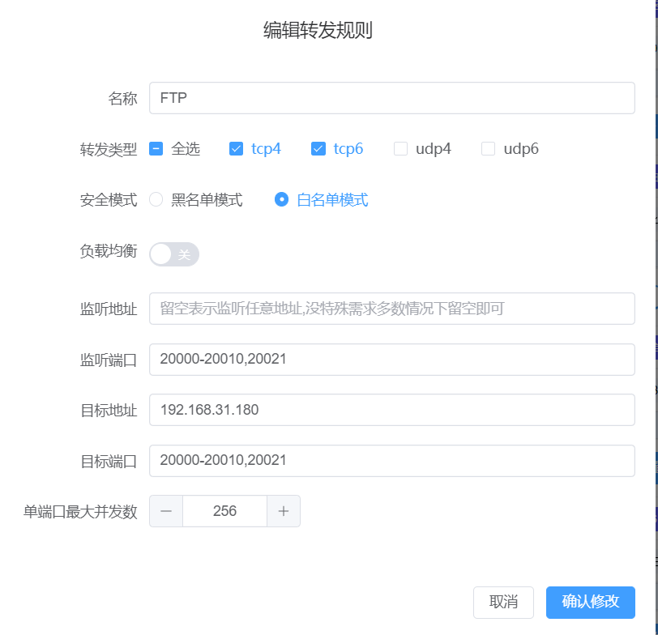
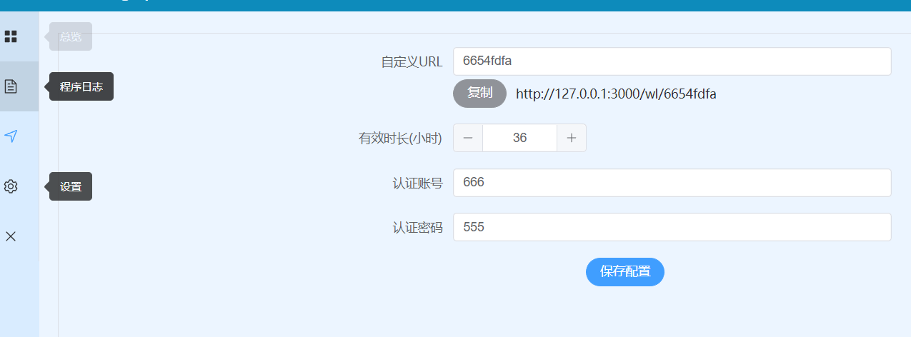
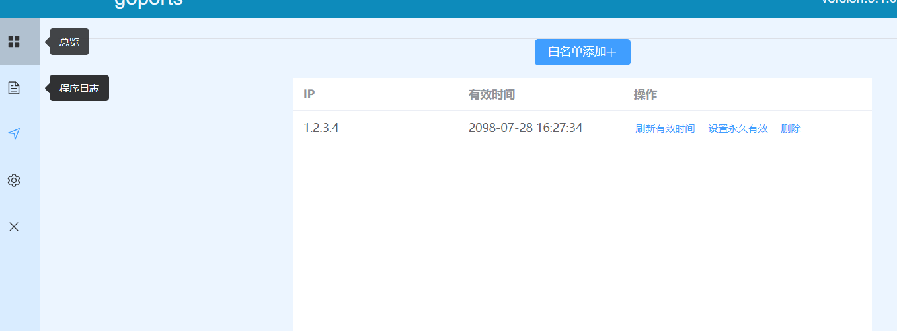
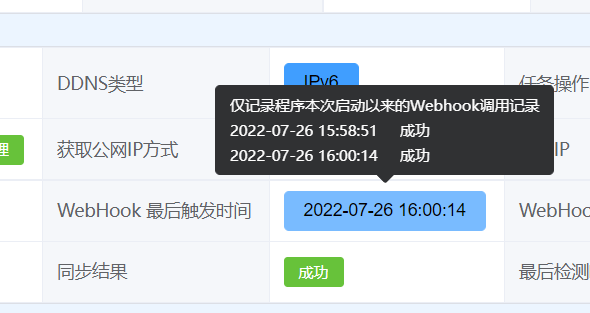
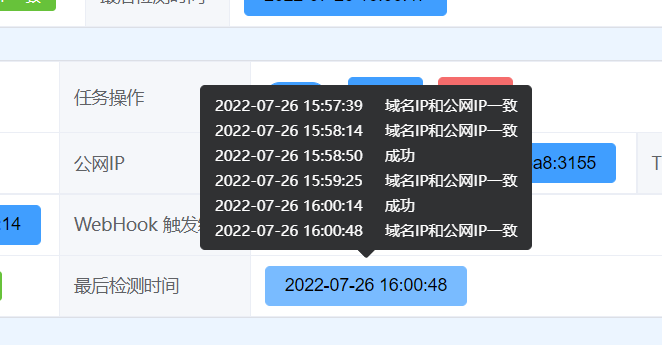

# Lucky(大吉)
 

 ## 注意：源码公布到1.4.10版本，后续暂无继续开源计划。

 ## 麻烦各位大佬发表lucky相关教程的时候不要加上“开源”神器，开源二字我不配，lucky后续也没开源打算。
        1.开源并不等于安全，闭源并不等于不安全。闭源软件开发也会受到安全人员的审查。无论是开源还是闭源软件，都有可能会受到各种安全人员的审查和研究。安全人员可以使用各种技术手段来检测软件的安全性和漏洞。
        2. 个人观点lucky这种应用类软件更多只是体力活，毫无技术含量，开源的优势在于透明度和社区参与，更多劳动力参与，但也可能导致功能过多、复杂度增加的问题。闭源软件的优势在于我想怎么写就怎么写,即使还未能从lucky中获利，lucky对我也有更深的特殊含义。
        3. 我对lucky的规划还有一大部分未实现，不想被人当免费劳动力使唤，不解释太多，就这样。

 
 ## 如果您是第一次使用Lucky，请务必先访问 https://lucky666.cn ，并仔细阅读相关的文档，以获得必要的信息和答案。在这些文档中，您可以了解到Lucky的基本功能和特性，掌握Lucky的使用方法，以及解决常见的问题和疑惑。
 

<!-- TOC -->
- [Lucky(大吉)](#)
  - [特性](#特性)
  - [一键安装](#一键安装)
  - [OpenwrtIPK包安装](#OpenwrtIPK包安装)
  - [使用](#使用)
  - [Docker中使用](#docker中使用)
  - [后台界面](#后台界面)

  - [开发编译](#开发编译)
  - [更新日志](#更新日志)
  - [使用注意与常见问题](#使用注意与常见问题)

<!-- /TOC -->


## 特性

ucky最初是作为一个小工具，由开发者为自己的个人使用而开发，用于替代socat，在小米路由AX6000官方系统上实现公网IPv6转内网IPv4的功能。Lucky的设计始终致力于让更多的Linux嵌入式设备运行，以实现或集成个人用户常用功能，降低用户的硬件和软件操作学习成本，同时引导使用者注意网络安全。随着版本更新和网友反馈，Lucky不断迭代改进，拥有更多功能和更好的性能，成为用户值得信赖的工具。

Lucky 的核心程序完全采用 Golang 实现，具有高效、稳定、跨平台等优点。其后台前端则采用 Vue3.2 技术进行开发，具有良好的用户体验和响应速度。此外，Lucky 的管理后台采用前后端分离的架构，第三方开发者也可以自由使用OpenToken轻松调用Lucky的各种功能接口。


## 功能模块

目前已经实现/集成的主要功能模块有
  - 端口转发
  - 动态域名(DDNS)
  - Web服务
  - Stun内网穿透
  - 网络唤醒
  - 计划任务
  - ACME自动证书
  - 网络存储


### 端口转发
  1. 主要用于实现公网 IPv6 转内网 IPv4 的 TCP/UDP 端口转发。
  2. 支持界面化的管理转发规则，用户可以通过 web 后台轻松地进行规则的添加、删除、修改等操作。
  3. 单条转发规则支持设置多个转发端口，这样可以实现多个内网服务端口的转发。
  4. 提供了一键开关和定时开关功能，用户可以根据自己的需求设置转发规则的开启和关闭时间，还可以使用计划任务模块进行定时开关。
  5. 单条规则支持黑白名单安全模式切换，用户可以根据需要选择使用白名单模式或黑名单模式。
  6. 白名单模式可以让没有安全验证的内网服务端口稍微安全一点暴露到公网，提高服务可用性。
  7. 实时记录最新的访问日志，方便用户了解转发情况。
  8. 规则列表日志一目了然，用户可以方便地追踪转发异常，及时进行排查和处理。


### 动态域名(DDNS)
  1. 支持接入多个不同的 DNS 服务商。
  2. 支持全功能自定义回调（Callback），包括设置 BasicAuth，方便接入任意 DNS 服务商。
  3. Webhook 支持自定义 headers。
  4. 内置常用免费 DNS 服务商设置模板（每步、No-IP、Dynv6、Dynu），通过自定义回调进行快速接入，仅需修改相应用户密码或 token 即可一键填充。


### Web服务
  1. 支持反向代理、重定向和 URL 跳转。
  2. 支持 HTTP 基本认证。
  3. 支持 IP 黑白名单模式。
  4. 支持 UserAgent 黑白名单。
  5. 规则日志清晰易懂，便于追踪异常。
  6. 支持一键开关规则和定时开关规则。


### Stun内网穿透
  1. 实现内网穿透，无需公网IPv4地址。
  2. 适合于国内运营商级NAT1宽带网络. 

### 网络唤醒
  1. 支持远程控制唤醒和关机操作
  2. 支持接入第三方物联网平台(点灯科技 巴法云),可通过各大平台的语音助手控制设备唤醒和关机.

### 计划任务
  1. 不依赖 Linux 系统的 Cron，支持 Windows 系统。
  2. 操作简便，可视化编辑。
  3. 可操作控制 Lucky 框架内的其他模块开关。

###  ACME自动证书
  1. 支持 ACME 自动证书的申请和续签。
  2. 支持 Cloudflare、阿里云和腾讯云三大 DNS 服务商。


### 网络存储
  1. 网络存储模块是一个应用范围广泛的模块，它提供了将本地存储、WebDAV和阿里云盘挂载到Lucky内部的各个文件类服务功能。
  2. 通过网络存储模块，你可以将添加的存储挂载到Web服务的文件服务、WebDAV、FTP和FileBrowser模块，实现更加便捷的文件管理和访问。


## 一键安装

- [一键安装详看这里](https://github.com/gdy666/lucky-files)


## OpenwrtIPK包安装

- [Openwrt IPK包](https://github.com/gdy666/luci-app-lucky)


## 使用
    

- 默认后台管理地址 http://<运行设备IP>:16601
  默认登录账号: 666
  默认登录密码: 666

- 常规使用请用 -cd <配置文件夹路径> 指定配置文件夹的方式运行 
    ```bash
    #仅指定配置文件夹路径(如果配置文件夹不存在会自动创建),建议使用绝对路径
    lucky -cd luckyconf

    ```


## Docker中使用

- 不挂载主机目录, 删除容器同时会删除配置

  ```bash
  # host模式, 同时支持IPv4/IPv6, Liunx系统推荐
  docker run -d --name lucky --restart=always --net=host gdy666/lucky
  # 桥接模式, 只支持IPv4, Mac/Windows推荐,windows 不推荐使用docker版本
  docker run -d --name lucky --restart=always -p 16601:16601 gdy666/lucky
  ```

- 在浏览器中打开`http://主机IP:16601`，修改你的配置，成功
- [可选] 挂载主机目录, 删除容器后配置不会丢失。可替换 `/root/luckyconf` 为主机目录, 配置文件夹为lucky

  ```bash
  docker run -d --name lucky --restart=always --net=host -v /root/luckyconf:/goodluck gdy666/lucky
  ```


## 后台界面




#### 动态域名服务






#### Http反向代理


#### 网络唤醒


#开发编译


    ```bash
    go build -v -tags "adminweb nomsgpack" -ldflags="-s -w"
    ```


# 更新日志
    2023-11-13 v2.4.8
        1. 修复存储模块中的一个问题，该问题导致在多目录设置下无法访问目录下的文件。
        2. 修复了 RaiDrive 挂载 Lucky WebDAV 后无法写入阿里云盘的 bug。
        3. 优化了 FileBrowser，在批量上传文件到阿里云盘驱动时的速度。
        4. 对存储模块进行了底层优化和修复已知的 bug。

    2023-11-08 v2.4.7
        1. 修复反向代理lucky WebDAV无法修改文件名问题。
        2. windows挂载分区:优化阿里云盘视频打开缓慢问题。
        3. 修复无网络状态下启动lucky时阿里云盘代码引发的奔溃问题。
        4. 升级 filebrowser 至 2.26.0版本。
        5. 修复存储管理中 webdav 忽略证书验证开关无效问题,确保自签证书的 webdav 正常连接。

    2023-11-01 v2.4.6
        新增功能：
            1. WebDAV 模块现在支持用户级前端显示设置。默认情况下，文件服务将显示在前端界面中。
        Bug 修复：
            1. 修复了阿里云盘授权过程中未获取写权限的 bug。如果您之前遇到写入失败的情况，请重新登录并进行授权。
            2. 修复了WebDAV模块 已知的 bug。

    2023-10-30 v2.4.5
        修复阿里云盘某些情况下写文件失败的bug

    2023-10-29 v2.4.4
        1. 修复了已知的存储读写 bug，提升了系统的稳定性和性能。
        2. 在 acme 证书功能中，新增了保存中间证书的选项，提供更全面的证书信息。
        3. 在 acme 证书申请功能中，增加了使用 IPv4 通道开关，以便用户根据需要进行灵活配置。
        4. 优化了 Filebrowser 的适配，现在可以进行 WebDAV 存储的写操作，并对阿里云盘存储进行了写文件适配。这意味着用户可以方便地在 Filebrowser 中对阿里云盘存储进行文件的上传和管理操作。无论是上传文件还是对已有文件进行修改、删除等操作，用户都可以通过 Filebrowser 进行灵活的操作，并享受到更便捷的文件管理体验。
        5. 在反代 WebDAV 后端时，解决了个别 WebDAV 客户端无法修改文件名的问题
        6. 修复了 SSL 证书禁用后仍会自动续签的 bug，确保在禁用 SSL ACME 证书后不会进行自动续签。

    2023-10-19 v2.4.1
        1. 修复了存储写文件错误的BUG。
        2. 优化了DDNS、Web服务和ACME证书处理和显示中文域名。

    2023-10-18 v2.4.0
        1.修复已知BUG
        2.存储管理新增阿里云盘支持。

    2023-09-22 v2.3.5
        1. windows版 : WinFSP对接模块优化了缓存策略，解决了无法播放TS视频文件的问题。
        2. SSL证书:新增了更多可选参数，以便更灵活地进行证书申请。
        3. Web反代:增加了"万事大吉"开关，能够自动添加常用反代header。
        4. 大吉内置FileBrowser:更新至版本2.25.0。


    2023-08-27 v2.3.1
        1. 优化 WebDav 存储读取性能，提升双重 WebDav 存储挂载的读取速度。
        2. 在 Windows 版本中新增了系统托盘图标，方便用户一键设置或取消开机启动 Lucky。
        3. 修复了在某些环境或软件下存储别名显示不正确的问题。

    2023-08-25 v2.3.0
        新增功能：
            网络存储分类下新增存储管理模块，支持：
            将WebDAV存储挂载到
            Lucky的Web服务-文件服务模块、
            FTP模块、WebDAV模块和FileBrowser模块。
            改进和优化：
            2. 在Windows版中，现在可以将WebDAV存储挂载为网络位置或本地磁盘。
            请注意，此功能需要先安装WinFsp。
        Bug修复：
            修复了一些已知问题，提升了软件的稳定性和性能。


    2023-08-06 
    v2.2.4
    1. 修复lucky 外网访问限制开关无效
    2. 修复 ftp , webdav，filebrowser模块 路径|read只读模式 识别错误

    v2.2.3
        1. 修复 FileBrowser 在挂载多个目录时修改文件名出错的问题。
        2. 修复 FileBrowser 在挂载多个目录时复制文件出错的问题。
        3. 修复在旧版 RaiDrive 下，WebDAV 挂载多个分区根目录时文件夹名显示异常的 bug。
        4. 修复 FileBrowser 在挂载多个目录时分享文件异常的问题。
        5. FileBrowser 的后台现在支持设置用户目录范围为多个目录，多个目录之间使用英文逗号（,）分割。


    2023-08-05 v2.2.2
        1. 修正了文件服务在显示软连接目录时的识别问题。
        2. FileBrowser 现在支持将多个目录/文件设置为根目录。

    2023-08-03 v2.2.1
        1. acme优化，消除泛域名CNAME记录对证书申请的影响。
            注意：AdGuardHome 由于DNS缓存会对证书申请造成影响。
        2. FTP模块支持软连接识别。
        3. FTP/WebDAV模块：
            增加了同时挂载目录/文件的支持。
            文件会显示在根目录下。
        4. 修复了FTP和WebDAV模块已知的bug。
        5. Web服务新增静态文件服务支持。
            可用作静态网页服务器。
            前端支持视频/音频在线播放。
            支持自动展示readme.md文件内容。
        6. 修复了恢复配置时没有恢复基础模块配置的bug。

    2023-07-23 v2.1.3
        1. 安全模块新增了证书映射功能，可以将证书同步复制到指定路径。支持证书内容变化后触发自定义脚本。
        2. ACME 增加了代理服务器设置。
        3. 支持编辑和修改证书。
        4. Web 服务反向代理已移除覆盖有返回内容的错误页面的机制

    2023-07-17 v2.1.2
        1. 优化acme模块，模块占用体积减少超过1M,不再发布小桔版本。
        2. ddns模块和acme模块对接dynv6

    2023-07-11 v2.1.1
        1.修复已知BUG
        2.新增FTP服务模块

    2023-07-08 v2.0.4
        1.修复v2.0.1 在windows环境以及docker环境下各模块服务端口显示占用的bug.
        2.Web服务的反向代理,当403状态码返回的内容是html格式的时候不再替换页面内容 （解决反代openwrt后台无法显示页面的bug）
            

    2023-07-05 v2.0.1
        1. 进行了前后端架构的重构和优化。
        2. 解决了在Linux systemd环境下无法通过lucky后台升级版本的问题。
        3. 修改了acme预设的dns服务器，提高了申请证书的成功概率。
        4. 将各功能模块的配置文件进行了分离，现在支持恢复配置文件，配置恢复同时支持1.X版本配置、lkcf单模块配置以及全局配置zip。请注意不要修改单模块lkcf配置的文件名。
        5. 初始配置现在默认开启了外网访问。
        6. Web服务反向代理现在新增了404和403页面提示，以应对不匹配规则的情况。
        7. 修复了因为ssl证书下载后因为文件名带有*号而在Windows管理器中无法显示的bug。
        8. 反向代理新增了追加客户端协议头到指定Header的功能
        9. STUN穿透模块增加全局Stun服务器设置
        10. WebDAV单用户支持挂载多目录
        11. 反向代理后端地址支持指定路径
        12. 反向代理 unraid不再需要填写/login
        13. 反向代理增加使用请求Host开关
        14. 反向代理支持自定义允许跨域的源和方法

    2023-04-23 v1.10.8
        1. 动态域名支持接入腾讯云API3.0

    2023-04-22 v1.10.7
        1.Webhook 新增支持PATCH
        2.动态域名模块底层重构
        3.Web服务模块修复已知BUG.新增端口冲突提醒
        4.stun模块优化修复已知BUG.

    2023-04-19 v1.10.6
        1.新增 后台登陆新增 2FA（TOTP）验证支持
        2.修复后台关于页面显示信息错误
        3.修复端口转发模块已知BUG.
        4.新增端口转发 端口被占用时提示。

    2023-04-15 v1.10.3
        1. 新增WebDAV模块
        2. 新增内置FileBrowser(大吉版本独有)
        3. 以后会同时发布三个版本
            1.1 大吉包含全功能模块
            1.2 lucky没有内置FileBrowser
            1.3 小桔没有内置FileBrowser和ACME功能模块
        4. 修复WebHook 请求主体不支持非JSON请求内容的BUG。
        5. 优化前端发送请求错误时即刻跳转到登陆首页的流程。
        
    2023-03-29 v1.9.3
        1.修复添加SSL路径方式判断证书错误的BUG.
        2.添加ACME证书时默认填充随机邮箱地址
        3.ACME 新增 ZeroSLL、Let's Encrypt(测试)、自定义接口支持。
        4.修改httprequest超时参数，避免DDNS查询IP阻塞


    2023-03-25 v1.9.0
        1.Web反向代理默认支持WebDAV。
        2.设置新增OpenToken选项开关
          无须模拟登陆即可调用后端API。
        3.修复断网情况下启动lucky，网络唤醒物联网平台无法重连BUG。
        4.网络唤醒修复广播地址为空时处理异常的情况
        5.各大模块规则设置加入默认简易模式，优化新手设置体验。
        6.优化前端体验
        7.Web服务 前端域名/路径支持
        8.反向代理规则增加跨域支持开关
        9.Web规则列表点击前端域名自动复制完整链接
        10.Web服务类型 重定向和跳转的目标地址支持变量
        {host},{port},{hostAndPort}
        11.Web服务规则 http/https支持使用同一端口
        12.Web服务模块日志分离，模块添加按钮旁边可以查看
        13.默认不显示lucky后台设置里面的登陆密码
        14.修复前端菜单模块列表偶尔不显示的bug
        15.SSL证书管理加入自动证书功能，支持自动申请续签cloudflare,阿里云，腾讯云域名证书。

    2023-03-13 v1.8.5
        1.修复Web服务中反向代理host没有携带显式端口
        2.捕获计划任务执行异常，防止程序奔溃。
        3.web反代增加 内置502提示页面。

    2023-03-11 v1.8.3
        1.网络唤醒 -客户端-第三方物联网平台设置新增跳过证书验证开关
        2.Lucky设置新增GCSetPercent开关，对内存占用敏感的用户可以尝试打开开关调整SetPercent参数，提高GC触发频率。
        3.动态域名服务指令获取IP方式新增支持管道指令
        4.新增计划任务模块
        5.设置页面增加windows服务管理
        6.分离网络唤醒模块日志
        7.新增ntp自动同步时间
        8.优化后台菜单显示形式
        9.stun 新增natpmp支持

    2023-02-13 v1.7.21
        1.各模块增加自动控制防火墙端口开关(仅针对linux iptables/ip6tables 有效)
        2.修复使用linux systemd 服务管理的lucky无法在后台重启或者升级的bug
        3.优化后台升级机制，docker也可以在后台上传tar.gz升级了。上传完成后需要手动关闭再开启一次容器。
        4.DDNS 新增全局Webhook
        5.STUN穿透新增全局Webhook
        6.端口转发模块增加禁用开关
        7.Stun穿透模块增加禁用模块开关
        8.修复二级路由下设备无法唤醒的BUG

    2023-1-15 v1.7.12
        1.优化UDP转发性能
        2.Web服务中的反向代理新增支持 忽略后端tls证书验证
        3.修复STUN穿透转发socks失败
        4.优化stun通道检测&维持机制
        5.stun穿透支持关闭lucky内置转发使用路由器转发
          在路由器设置端口转发规则（STUN通道端口指向需要代理的IP服务端口）

    2022-12-24 v1.7.5
        1.全局协程增加异常日志捕获机制。
        2.优化网络唤醒客户端登录流程。
          修复由于电脑时间不准确导致无法连接服务端的问题
          (建议被控制端的lucky也需要更新到此版本)
        3.网络唤醒模块新增快捷控制页面。
          (需要在网络唤醒服务端设置里面打开)
        4.网络唤醒模块新增自定义设备上下线webhook功能。

    2022-12-13 v1.7.4
        DDNS模块新增自定义指令方式获取IP

    2022-12-11 v1.7.3
        修复使用STUN穿透TCP时占用CPU过高的BUG

    2022-12-09 v1.7.2
        1.新增STUN IPv4 内网穿透模块
        2.反向代理模块改名为Web服务
        3.Web服务增加跳转和重定向支持

    2022-11-24 v1.6.2
        1.加入后台登录日志
        2.适配新版本luci-app-lucky
        3.此版本开始以后会同时发布多平台openwrt ipk安装包

    2022-11-15 v1.6.1
        主要修复启动参数-p指定后台端口没有优先于配置文件相应参数
        导致luci-app-lucky版本用户在后台修改到被占用端口lucky无法启动的问题.

    2022-11-12 v1.6.0
        1.后台管理端口 http/https支持监听同一端口
        2.新增后台支持直接上传tar.gz 文件一键升级/替换lucky版本.
        3.新增自定义安全入口设置,安全隐藏后台地址.
        4.修复网络唤醒客户端由于时间和服务端相差大于30秒时连接中止而没有不断重连的问题.
        5.修复端口转发规则无法开关bug.
        6.默认内嵌 http://curl.haxx.se/ca/cacert.pem CA证书,解决docker或个别嵌入式设备环境下需要关闭TLS验证才可以调用https接口的情况,默认不再跳过TLS证书验证.

    2022-10-26 v1.5.1
        1.新增网络唤醒模块
        2.优化ddns服务
        3.其它细节优化

    2022-10-14 v1.4.10
        1.修复特定情况下反向代理规则添加后无法编辑删除的bug.

    2022-10-08 版本1.4.9
        1.反向代理新增https支持。
        2.加入SSL证书管理模块
        3.后台接口支持HTTPS
        4.端口转发模块重构优化，移除命令行配置功能,注意使用此版本后原来的端口转发配置会全部消失。
        5.修复已知BUG.
        6.源码不再和二进制版本同时发布.
        


。


## 使用注意与常见问题

 - 不同于防火墙端口转发规则,不要设置没有用上的端口,会增加内存的使用.

 - 小米路由 ipv4 类型的80和443端口被占用,但只设置监听tcp6(ipv6)的80/443端口转发规则完全没问题.

 - 如果需要使用白名单模式,请根据自身需求打开外网访问后台管理页面开关.

 - 转发规则启用异常,端口转发没有生效时请登录后台查看日志.

