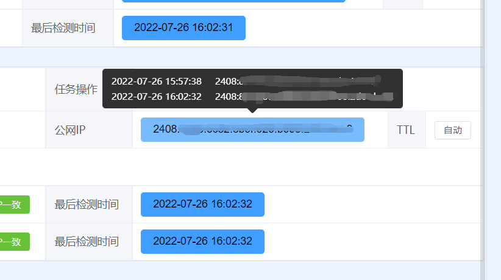

# Lucky(大吉)
 
<!-- TOC -->
- [Lucky(大吉)](#)
  - [特性](#特性)
  - [一键安装](#一键安装)
  - [OpenwrtIPK包安装](#OpenwrtIPK包安装)
  - [使用](#使用)
  - [Docker中使用](#docker中使用)
  - [后台界面](#后台界面)

  - [开发编译](#开发编译)
  - [更新日志](#更新日志)
  - [使用注意与常见问题](#使用注意与常见问题)

<!-- /TOC -->


## 特性

- 这是一个自用的,目前主要运行在自己的主路由(小米ax6000)里面的程序.

    - 后端golang,前端vue3
    - 支持Windows、Linux系统，支持x86、ARM、MIPS、MIPSLE等架构

- 目前已经实现的功能有
    - 1.替代socat,主要用于公网IPv6 tcp/udp转 内网ipv4
        - 支持界面化(web后台)管理转发规则,单条转发规则支持设置多个转发端口,一键开关指定转发规则
        - 单条规则支持黑白名单安全模式切换,白名单模式可以让没有安全验证的内网服务端口稍微安全一丢丢暴露到公网
        - Web后台支持查看最新100条日志
        - 另有精简版不带后台,支持命令行快捷设置转发规则,有利于空间有限的嵌入式设备运行.(不再提供编译版本,如有需求可以自己编译)
    - 2.动态域名服务
        - 参考和部分代码来自 https://github.com/jeessy2/ddns-go
        - 在ddns-go的基础上主要改进/增加的功能有
            - 1.同时支持接入多个不同的DNS服务商
            - 2.支持http/https/socks5代理设置
            - 3.自定义(Callback)和Webhook支持自定义headers
            - 4.支持BasicAuth
            - 5.DDNS任务列表即可了解全部信息(包含错误信息),无需单独查看日志.
            - 6.调用DNS服务商接口更新域名信息前可以先通过DNS解析域名比较IP,减少对服务商接口调用.
            - 其它细节功能自己慢慢发现...
            - 没有文档,后台各处的提示信息已经足够多.
            - 支持的DNS服务商和DDNS-GO一样,有Alidns(阿里云),百度云,Cloudflare,Dnspod(腾讯云),华为云.自定义(Callback)内置有每步,No-IP,Dynv6,Dynu模版,一键填充,仅需修改相应用户密码或者token即可快速接入.
    - 3.Web服务
        - 特点
            - 设置简单
            - 支持HttpBasic认证  
            - 支持IP黑白名单
            - 支持UserAgent黑白名单
            - 日志记录最近访问情况
            - 一键开关子规则
            - 前端域名与后端地址 支持一对一,一对多(均衡负载),多对多(下一级反向代理)
            - 支持307重定向和跳转
    - 4.网络唤醒
        - 特点
            - 支持远程控制唤醒和关机操作
                - 远程唤醒需要 待唤醒端所在局域网内有开启中继唤醒指令的lucky唤醒客户端
                - 远程关机需要 待关机端运行有luck唤醒客户端
            - 支持接入第三方物联网平台(点灯科技 巴法云),可通过各大平台的语音助手控制设备唤醒和关机.
                - 点灯科技支持 小爱同学 小度 天猫精灵
                - 巴法云支持小爱同学 小度 天猫精灵 google语音 AmazonAlexa
            - 具备但一般用不上的功能:支持一个设备设置多组网卡mac和多个广播地址,实现批量控制设备.
    - 5.STUN IPv4内网穿透
        - 特点
            - 无需额外服务器,将局域网服务端口暴露于IPv4公网(端口随机)
            - 适合于国内运营商级NAT1宽带网络. 
- 将要实现的功能
    - 有建议可联系作者.


## 一键安装

- [一键安装详看这里](https://github.com/gdy666/lucky-files)


## OpenwrtIPK包安装

- [Openwrt IPK包下载页面](https://github.com/gdy666/luci-app-lucky/releases)

    如果第一次安装不知道自己设备的CPU架构,可以先安装
    luci-app-lucky_XXX_all.ipk 和 luci-i18n-lucky-zh-cn_XXX_all.ipk
    然后登录openwrt后台在菜单 服务---lucky 页面查看显示的CPU架构,
    然后安装相应架构的lucky_XXX_Openwrt_(CPU架构) IPK.

    如果原来已经通过一键脚本方式安装了lucky,请在安装ipk包之前卸载(重新执行一次一键安装指令,选项2卸载.)
    卸载lucky之前可以在lucky后台的设置页面下载备份配置.


## 使用


- [最新内测版本请加Q群：602427029]
    

- 默认后台管理地址 http://<运行设备IP>:16601
  默认登录账号: 666
  默认登录密码: 666

- 常规使用请用 -c <配置文件路径> 指定配置文件的路由方式运行 , -p <后台端口> 可以指定后台管理端口
    ```bash
    #仅指定配置文件路径(如果配置文件不存在会自动创建),建议使用绝对路径
    lucky -c 666.conf
    #同时指定后台端口 8899
    lucky -c 666.conf -p 8899
    ```


## Docker中使用

- 不挂载主机目录, 删除容器同时会删除配置

  ```bash
  # host模式, 同时支持IPv4/IPv6, Liunx系统推荐
  docker run -d --name lucky --restart=always --net=host gdy666/lucky
  # 桥接模式, 只支持IPv4, Mac/Windows推荐,windows另外会有专用版本支持ipv6,待开发
  docker run -d --name lucky --restart=always -p 16601:16601 gdy666/lucky
  ```

- 在浏览器中打开`http://主机IP:16601`，修改你的配置，成功
- [可选] 挂载主机目录, 删除容器后配置不会丢失。可替换 `/root/luckyconf` 为主机目录, 配置文件为lucky.conf

  ```bash
  docker run -d --name lucky --restart=always --net=host -v /root/luckyconf:/goodluck gdy666/lucky
  ```


## 后台界面


#### 动态域名服务





#### Http反向代理


#### 网络唤醒


#开发编译


    ```bash
    go build -v -tags "adminweb nomsgpack" -ldflags="-s -w"
    ```


# 更新日志

    2023-03-13 v1.8.5
        1.修复Web服务中反向代理host没有携带显式端口
        2.捕获计划任务执行异常，防止程序奔溃。
        3.web反代增加 内置502提示页面。

    2023-03-11 v1.8.3
        1.网络唤醒 -客户端-第三方物联网平台设置新增跳过证书验证开关
        2.Lucky设置新增GCSetPercent开关，对内存占用敏感的用户可以尝试打开开关调整SetPercent参数，提高GC触发频率。
        3.动态域名服务指令获取IP方式新增支持管道指令
        4.新增计划任务模块
        5.设置页面增加windows服务管理
        6.分离网络唤醒模块日志
        7.新增ntp自动同步时间
        8.优化后台菜单显示形式
        9.stun 新增natpmp支持

    2023-02-13 v1.7.21
        1.各模块增加自动控制防火墙端口开关(仅针对linux iptables/ip6tables 有效)
        2.修复使用linux systemd 服务管理的lucky无法在后台重启或者升级的bug
        3.优化后台升级机制，docker也可以在后台上传tar.gz升级了。上传完成后需要手动关闭再开启一次容器。
        4.DDNS 新增全局Webhook
        5.STUN穿透新增全局Webhook
        6.端口转发模块增加禁用开关
        7.Stun穿透模块增加禁用模块开关
        8.修复二级路由下设备无法唤醒的BUG

    2023-1-15 v1.7.12
        1.优化UDP转发性能
        2.Web服务中的反向代理新增支持 忽略后端tls证书验证
        3.修复STUN穿透转发socks失败
        4.优化stun通道检测&维持机制
        5.stun穿透支持关闭lucky内置转发使用路由器转发
          在路由器设置端口转发规则（STUN通道端口指向需要代理的IP服务端口）

    2022-12-24 v1.7.5
        1.全局协程增加异常日志捕获机制。
        2.优化网络唤醒客户端登录流程。
          修复由于电脑时间不准确导致无法连接服务端的问题
          (建议被控制端的lucky也需要更新到此版本)
        3.网络唤醒模块新增快捷控制页面。
          (需要在网络唤醒服务端设置里面打开)
        4.网络唤醒模块新增自定义设备上下线webhook功能。

    2022-12-13 v1.7.4
        DDNS模块新增自定义指令方式获取IP

    2022-12-11 v1.7.3
        修复使用STUN穿透TCP时占用CPU过高的BUG

    2022-12-09 v1.7.2
        1.新增STUN IPv4 内网穿透模块
        2.反向代理模块改名为Web服务
        3.Web服务增加跳转和重定向支持

    2022-11-24 v1.6.2
        1.加入后台登录日志
        2.适配新版本luci-app-lucky
        3.此版本开始以后会同时发布多平台openwrt ipk安装包

    2022-11-15 v1.6.1
        主要修复启动参数-p指定后台端口没有优先于配置文件相应参数
        导致luci-app-lucky版本用户在后台修改到被占用端口lucky无法启动的问题.

    2022-11-12 v1.6.0
        1.后台管理端口 http/https支持监听同一端口
        2.新增后台支持直接上传tar.gz 文件一键升级/替换lucky版本.
        3.新增自定义安全入口设置,安全隐藏后台地址.
        4.修复网络唤醒客户端由于时间和服务端相差大于30秒时连接中止而没有不断重连的问题.
        5.修复端口转发规则无法开关bug.
        6.默认内嵌 http://curl.haxx.se/ca/cacert.pem CA证书,解决docker或个别嵌入式设备环境下需要关闭TLS验证才可以调用https接口的情况,默认不再跳过TLS证书验证.

    2022-10-26 v1.5.1
        1.新增网络唤醒模块
        2.优化ddns服务
        3.其它细节优化

    2022-10-14 v1.4.10
        1.修复特定情况下反向代理规则添加后无法编辑删除的bug.

    2022-10-08 版本1.4.9
        1.反向代理新增https支持。
        2.加入SSL证书管理模块
        3.后台接口支持HTTPS
        4.端口转发模块重构优化，移除命令行配置功能,注意使用此版本后原来的端口转发配置会全部消失。
        5.修复已知BUG.
        6.源码不再和二进制版本同时发布.
        


。


## 使用注意与常见问题

 - 不同于防火墙端口转发规则,不要设置没有用上的端口,会增加内存的使用.

 - 小米路由 ipv4 类型的80和443端口被占用,但只设置监听tcp6(ipv6)的80/443端口转发规则完全没问题.

 - 如果需要使用白名单模式,请根据自身需求打开外网访问后台管理页面开关.

 - 转发规则启用异常,端口转发没有生效时请登录后台查看日志.

