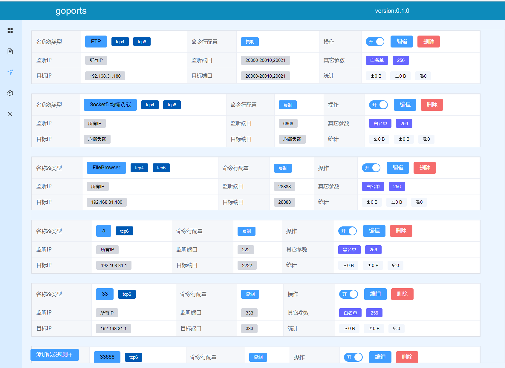

# Lucky(大吉)
 
 
 ## 如果您是第一次使用Lucky，请务必先访问 https://lucky666.cn ，并仔细阅读相关的文档，以获得必要的信息和答案。在这些文档中，您可以了解到Lucky的基本功能和特性，掌握Lucky的使用方法，以及解决常见的问题和疑惑。
 

<!-- TOC -->
- [Lucky(大吉)](#)
  - [特性](#特性)
  - [一键安装](#一键安装)
  - [OpenwrtIPK包安装](#OpenwrtIPK包安装)
  - [使用](#使用)
  - [Docker中使用](#docker中使用)
  - [后台界面](#后台界面)

  - [开发编译](#开发编译)
  - [更新日志](#更新日志)
  - [使用注意与常见问题](#使用注意与常见问题)

<!-- /TOC -->


## 特性

- 这是一个自用的,目前主要运行在自己的主路由(小米ax6000)里面的程序.

    - 后端golang,前端vue3
    - 支持Windows、Linux系统，支持x86、ARM、MIPS、MIPSLE等架构

- 目前已经实现的功能有
    - 1.替代socat,主要用于公网IPv6 tcp/udp转 内网ipv4
        - 支持界面化(web后台)管理转发规则,单条转发规则支持设置多个转发端口,一键开关指定转发规则
        - 单条规则支持黑白名单安全模式切换,白名单模式可以让没有安全验证的内网服务端口稍微安全一丢丢暴露到公网
        - Web后台支持查看最新100条日志
        - 另有精简版不带后台,支持命令行快捷设置转发规则,有利于空间有限的嵌入式设备运行.(不再提供编译版本,如有需求可以自己编译)
    - 2.动态域名服务
        - 参考和部分代码来自 https://github.com/jeessy2/ddns-go
        - 在ddns-go的基础上主要改进/增加的功能有
            - 1.同时支持接入多个不同的DNS服务商
            - 2.支持http/https/socks5代理设置
            - 3.自定义(Callback)和Webhook支持自定义headers
            - 4.支持BasicAuth
            - 5.DDNS任务列表即可了解全部信息(包含错误信息),无需单独查看日志.
            - 6.调用DNS服务商接口更新域名信息前可以先通过DNS解析域名比较IP,减少对服务商接口调用.
            - 其它细节功能自己慢慢发现...
            - 没有文档,后台各处的提示信息已经足够多.
            - 支持的DNS服务商和DDNS-GO一样,有Alidns(阿里云),百度云,Cloudflare,Dnspod(腾讯云),华为云.自定义(Callback)内置有每步,No-IP,Dynv6,Dynu模版,一键填充,仅需修改相应用户密码或者token即可快速接入.
    - 3.Web服务
        - 特点
            - 设置简单
            - 支持HttpBasic认证  
            - 支持IP黑白名单
            - 支持UserAgent黑白名单
            - 日志记录最近访问情况
            - 一键开关子规则
            - 前端域名与后端地址 支持一对一,一对多(均衡负载),多对多(下一级反向代理)
            - 支持307重定向和跳转
    - 4.网络唤醒
        - 特点
            - 支持远程控制唤醒和关机操作
                - 远程唤醒需要 待唤醒端所在局域网内有开启中继唤醒指令的lucky唤醒客户端
                - 远程关机需要 待关机端运行有luck唤醒客户端
            - 支持接入第三方物联网平台(点灯科技 巴法云),可通过各大平台的语音助手控制设备唤醒和关机.
                - 点灯科技支持 小爱同学 小度 天猫精灵
                - 巴法云支持小爱同学 小度 天猫精灵 google语音 AmazonAlexa
            - 具备但一般用不上的功能:支持一个设备设置多组网卡mac和多个广播地址,实现批量控制设备.
    - 5.STUN IPv4内网穿透
        - 特点
            - 无需额外服务器,将局域网服务端口暴露于IPv4公网(端口随机)
            - 适合于国内运营商级NAT1宽带网络. 
    - 6.计划任务
        - 特点
            - 不依赖linux系统的cron，
            - 操作简易，可视化编辑。
    - 7.自动申请/续签ACME证书
        - 特点
            - 自动续签
            - 支持Cloudflare 腾讯云 阿里云 三个域名商


## 一键安装

- [一键安装详看这里](https://github.com/gdy666/lucky-files)


## OpenwrtIPK包安装

- [Openwrt IPK包下载页面](https://github.com/gdy666/luci-app-lucky/releases)

    如果第一次安装不知道自己设备的CPU架构,可以先安装
    luci-app-lucky_XXX_all.ipk 和 luci-i18n-lucky-zh-cn_XXX_all.ipk
    然后登录openwrt后台在菜单 服务---lucky 页面查看显示的CPU架构,
    然后安装相应架构的lucky_XXX_Openwrt_(CPU架构) IPK.

    如果原来已经通过一键脚本方式安装了lucky,请在安装ipk包之前卸载(重新执行一次一键安装指令,选项2卸载.)
    卸载lucky之前可以在lucky后台的设置页面下载备份配置.


## 使用


- [最新内测版本请加Q群：602427029]
    

- 默认后台管理地址 http://<运行设备IP>:16601
  默认登录账号: 666
  默认登录密码: 666

- 常规使用请用 -c <配置文件路径> 指定配置文件的路由方式运行 , -p <后台端口> 可以指定后台管理端口
    ```bash
    #仅指定配置文件路径(如果配置文件不存在会自动创建),建议使用绝对路径
    lucky -c 666.conf
    #同时指定后台端口 8899
    lucky -c 666.conf -p 8899
    ```


## Docker中使用

- 不挂载主机目录, 删除容器同时会删除配置

  ```bash
  # host模式, 同时支持IPv4/IPv6, Liunx系统推荐
  docker run -d --name lucky --restart=always --net=host gdy666/lucky
  # 桥接模式, 只支持IPv4, Mac/Windows推荐,windows 不推荐使用docker版本
  docker run -d --name lucky --restart=always -p 16601:16601 gdy666/lucky
  ```

- 在浏览器中打开`http://主机IP:16601`，修改你的配置，成功
- [可选] 挂载主机目录, 删除容器后配置不会丢失。可替换 `/root/luckyconf` 为主机目录, 配置文件为lucky.conf

  ```bash
  docker run -d --name lucky --restart=always --net=host -v /root/luckyconf:/goodluck gdy666/lucky
  ```


## 后台界面




#### 动态域名服务


#### Http反向代理


#### 网络唤醒


#开发编译


    ```bash
    go build -v -tags "adminweb nomsgpack" -ldflags="-s -w"
    ```


# 更新日志

    2023-07-11 v2.1.1
        1.修复已知BUG
        2.新增FTP服务模块

    2023-07-08 v2.0.4
        1.修复v2.0.1 在windows环境以及docker环境下各模块服务端口显示占用的bug.
        2.Web服务的反向代理,当403状态码返回的内容是html格式的时候不再替换页面内容 （解决反代openwrt后台无法显示页面的bug）
            

    2023-07-05 v2.0.1
        1. 进行了前后端架构的重构和优化。
        2. 解决了在Linux systemd环境下无法通过lucky后台升级版本的问题。
        3. 修改了acme预设的dns服务器，提高了申请证书的成功概率。
        4. 将各功能模块的配置文件进行了分离，现在支持恢复配置文件，配置恢复同时支持1.X版本配置、lkcf单模块配置以及全局配置zip。请注意不要修改单模块lkcf配置的文件名。
        5. 初始配置现在默认开启了外网访问。
        6. Web服务反向代理现在新增了404和403页面提示，以应对不匹配规则的情况。
        7. 修复了因为ssl证书下载后因为文件名带有*号而在Windows管理器中无法显示的bug。
        8. 反向代理新增了追加客户端协议头到指定Header的功能
        9. STUN穿透模块增加全局Stun服务器设置
        10. WebDAV单用户支持挂载多目录
        11. 反向代理后端地址支持指定路径
        12. 反向代理 unraid不再需要填写/login
        13. 反向代理增加使用请求Host开关
        14. 反向代理支持自定义允许跨域的源和方法

    2023-04-23 v1.10.8
        1. 动态域名支持接入腾讯云API3.0

    2023-04-22 v1.10.7
        1.Webhook 新增支持PATCH
        2.动态域名模块底层重构
        3.Web服务模块修复已知BUG.新增端口冲突提醒
        4.stun模块优化修复已知BUG.

    2023-04-19 v1.10.6
        1.新增 后台登陆新增 2FA（TOTP）验证支持
        2.修复后台关于页面显示信息错误
        3.修复端口转发模块已知BUG.
        4.新增端口转发 端口被占用时提示。

    2023-04-15 v1.10.3
        1. 新增WebDAV模块
        2. 新增内置FileBrowser(大吉版本独有)
        3. 以后会同时发布三个版本
            1.1 大吉包含全功能模块
            1.2 lucky没有内置FileBrowser
            1.3 小桔没有内置FileBrowser和ACME功能模块
        4. 修复WebHook 请求主体不支持非JSON请求内容的BUG。
        5. 优化前端发送请求错误时即刻跳转到登陆首页的流程。
        
    2023-03-29 v1.9.3
        1.修复添加SSL路径方式判断证书错误的BUG.
        2.添加ACME证书时默认填充随机邮箱地址
        3.ACME 新增 ZeroSLL、Let's Encrypt(测试)、自定义接口支持。
        4.修改httprequest超时参数，避免DDNS查询IP阻塞


    2023-03-25 v1.9.0
        1.Web反向代理默认支持WebDAV。
        2.设置新增OpenToken选项开关
          无须模拟登陆即可调用后端API。
        3.修复断网情况下启动lucky，网络唤醒物联网平台无法重连BUG。
        4.网络唤醒修复广播地址为空时处理异常的情况
        5.各大模块规则设置加入默认简易模式，优化新手设置体验。
        6.优化前端体验
        7.Web服务 前端域名/路径支持
        8.反向代理规则增加跨域支持开关
        9.Web规则列表点击前端域名自动复制完整链接
        10.Web服务类型 重定向和跳转的目标地址支持变量
        {host},{port},{hostAndPort}
        11.Web服务规则 http/https支持使用同一端口
        12.Web服务模块日志分离，模块添加按钮旁边可以查看
        13.默认不显示lucky后台设置里面的登陆密码
        14.修复前端菜单模块列表偶尔不显示的bug
        15.SSL证书管理加入自动证书功能，支持自动申请续签cloudflare,阿里云，腾讯云域名证书。

    2023-03-13 v1.8.5
        1.修复Web服务中反向代理host没有携带显式端口
        2.捕获计划任务执行异常，防止程序奔溃。
        3.web反代增加 内置502提示页面。

    2023-03-11 v1.8.3
        1.网络唤醒 -客户端-第三方物联网平台设置新增跳过证书验证开关
        2.Lucky设置新增GCSetPercent开关，对内存占用敏感的用户可以尝试打开开关调整SetPercent参数，提高GC触发频率。
        3.动态域名服务指令获取IP方式新增支持管道指令
        4.新增计划任务模块
        5.设置页面增加windows服务管理
        6.分离网络唤醒模块日志
        7.新增ntp自动同步时间
        8.优化后台菜单显示形式
        9.stun 新增natpmp支持

    2023-02-13 v1.7.21
        1.各模块增加自动控制防火墙端口开关(仅针对linux iptables/ip6tables 有效)
        2.修复使用linux systemd 服务管理的lucky无法在后台重启或者升级的bug
        3.优化后台升级机制，docker也可以在后台上传tar.gz升级了。上传完成后需要手动关闭再开启一次容器。
        4.DDNS 新增全局Webhook
        5.STUN穿透新增全局Webhook
        6.端口转发模块增加禁用开关
        7.Stun穿透模块增加禁用模块开关
        8.修复二级路由下设备无法唤醒的BUG

    2023-1-15 v1.7.12
        1.优化UDP转发性能
        2.Web服务中的反向代理新增支持 忽略后端tls证书验证
        3.修复STUN穿透转发socks失败
        4.优化stun通道检测&维持机制
        5.stun穿透支持关闭lucky内置转发使用路由器转发
          在路由器设置端口转发规则（STUN通道端口指向需要代理的IP服务端口）

    2022-12-24 v1.7.5
        1.全局协程增加异常日志捕获机制。
        2.优化网络唤醒客户端登录流程。
          修复由于电脑时间不准确导致无法连接服务端的问题
          (建议被控制端的lucky也需要更新到此版本)
        3.网络唤醒模块新增快捷控制页面。
          (需要在网络唤醒服务端设置里面打开)
        4.网络唤醒模块新增自定义设备上下线webhook功能。

    2022-12-13 v1.7.4
        DDNS模块新增自定义指令方式获取IP

    2022-12-11 v1.7.3
        修复使用STUN穿透TCP时占用CPU过高的BUG

    2022-12-09 v1.7.2
        1.新增STUN IPv4 内网穿透模块
        2.反向代理模块改名为Web服务
        3.Web服务增加跳转和重定向支持

    2022-11-24 v1.6.2
        1.加入后台登录日志
        2.适配新版本luci-app-lucky
        3.此版本开始以后会同时发布多平台openwrt ipk安装包

    2022-11-15 v1.6.1
        主要修复启动参数-p指定后台端口没有优先于配置文件相应参数
        导致luci-app-lucky版本用户在后台修改到被占用端口lucky无法启动的问题.

    2022-11-12 v1.6.0
        1.后台管理端口 http/https支持监听同一端口
        2.新增后台支持直接上传tar.gz 文件一键升级/替换lucky版本.
        3.新增自定义安全入口设置,安全隐藏后台地址.
        4.修复网络唤醒客户端由于时间和服务端相差大于30秒时连接中止而没有不断重连的问题.
        5.修复端口转发规则无法开关bug.
        6.默认内嵌 http://curl.haxx.se/ca/cacert.pem CA证书,解决docker或个别嵌入式设备环境下需要关闭TLS验证才可以调用https接口的情况,默认不再跳过TLS证书验证.

    2022-10-26 v1.5.1
        1.新增网络唤醒模块
        2.优化ddns服务
        3.其它细节优化

    2022-10-14 v1.4.10
        1.修复特定情况下反向代理规则添加后无法编辑删除的bug.

    2022-10-08 版本1.4.9
        1.反向代理新增https支持。
        2.加入SSL证书管理模块
        3.后台接口支持HTTPS
        4.端口转发模块重构优化，移除命令行配置功能,注意使用此版本后原来的端口转发配置会全部消失。
        5.修复已知BUG.
        6.源码不再和二进制版本同时发布.
        


。


## 使用注意与常见问题

 - 不同于防火墙端口转发规则,不要设置没有用上的端口,会增加内存的使用.

 - 小米路由 ipv4 类型的80和443端口被占用,但只设置监听tcp6(ipv6)的80/443端口转发规则完全没问题.

 - 如果需要使用白名单模式,请根据自身需求打开外网访问后台管理页面开关.

 - 转发规则启用异常,端口转发没有生效时请登录后台查看日志.

